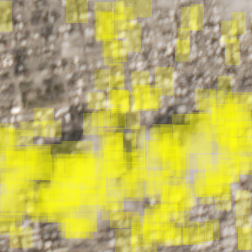
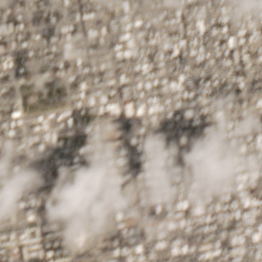
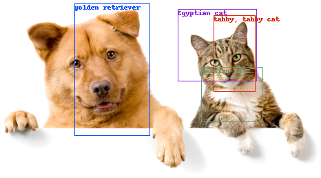

# Cloud Detection

This is the inference portion of the cloudless pipeline once you have trained a
model to classify clouds.
There are two scripts:
  - `localization.py`: generates candidate regions in an image using a [fork of Selective Search from here](https://github.com/BradNeuberg/selective_search_py). The [unforked Selective Search](https://github.com/belltailjp/selective_search_py) had a dependency on Python 3 but we back ported it to Python 2.7.
  - `predict.py`: standard inference script using Caffe's `classifier.py`
    class. Can take in a single image or a directory of images containing
    crops.

## Dependencies
- [Selective Search](https://github.com/BradNeuberg/selective_search_py)
- [Caffe](https://github.com/BVLC/caffe)

## Steps
- Set env vars CAFFE_HOME and SELECTIVE_SEARCH

```
cd src/cloudless/inference
./localization.py -i cloud_test.jpg --classes cloud-classes.txt --config ../../caffe_model/bvlc_alexnet/bounding_box.prototxt --weights ../../caffe_model/bvlc_alexnet/bvlc_alexnet_finetuned.caffemodel --ks 100 --max_regions 30 --only_for_class 1
```





Testing against imagenet (not cloudless) for debugging:
```
cd src/cloudless/inference
./localization.py -i cat.jpg --classes imagenet-classes.txt --config ../../caffe_model/bvlc_alexnet/bounding_box_imagenet.prototxt --weights ../../caffe_model/bvlc_alexnet/bvlc_alexnet.caffemodel --ks 125 --max_regions 4
open cat-regions.png
```



This will write out the image with bounding boxes drawn on it, including a JSON file with machine readable info on the top bounding boxes.
